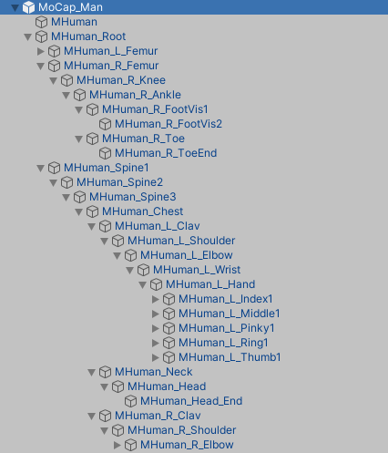
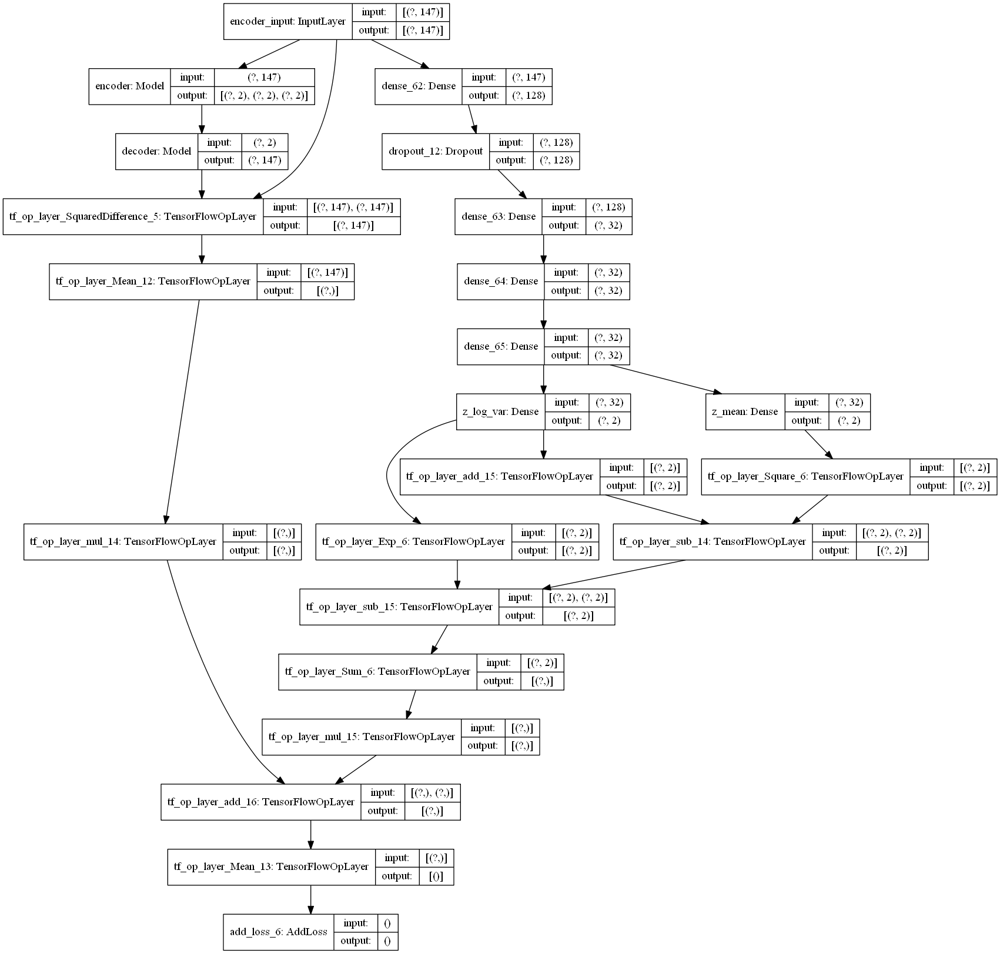
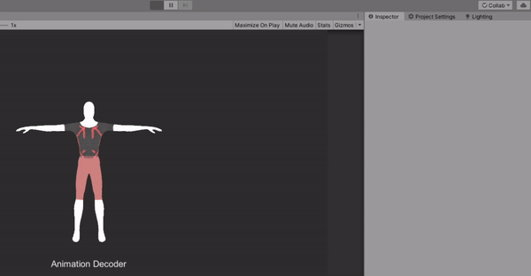

# Animation Autoencoder
Procedurally generate or interpolate between animations for a bipedal humanoid using a multi-pose autoencoder. TFlite is used within Unity to create animations in real time. The autoencoder is trained on animations from 3D content sites (e.g. https://www.mixamo.com/) and motion capture data from the mobile app: [Ditto](). Future encoders will be trained on data recorded from a curated list of videos. 

## Dependencies
- Python 3+
- Unity 3D

## Generate training data

### Record data with Mixamo
- download a few animations from https://www.mixamo.com/ 
- open Unity to the scene "Recorder"
- place animations in the folder `Animations/`
- Play the scene


### Create animations with a mobile device

Record an animation with our mobile app: [Ditto]() and export the data as an ascii, .fbx or .anim file


## Procedural Animations
Joint rotations are recorded from a rigged character. The rotations are encoded using a fully connected neural network into a latent space of N dimensions. The latent space can be randomly sampled to create new poses. Sequences of poses can be constructed with bezier curves through the latent space


Unity saves data to a text file in a format like such, where each line is one pose. The tuples represent quaternions for each joint in a skeleton 
```
(-0.516, -0.478, 0.586, 0.402)(-0.397, -0.555, 0.505, 0.528)(-0.691, -0.117, 0.651, 0.293)(-0.700, 0.038, 0.699, 0.143)(-0.700, 0.038, 0.699, 0.143)(-0.696, -0.040, 0.682, 0.221)(-0.696, -0.040, 0.682, 0.221)(-0.549, -0.030, 0.804, -0.226)(-0.497, -0.314, 0.604, 0.539)(-0.509, -0.288, 0.673, 0.454)(-0.559, -0.170, 0.756, 0.295)(-0.559, -0.170, 0.756, 0.295)(-0.518, -0.249, 0.714, 0.400)(-0.518, -0.249, 0.714, 0.400)(-0.408, 0.017, 0.090, 0.908)(-0.523, 0.006, 0.091, 0.847)(-0.406, -0.003, -0.177, 0.897)(-0.406, -0.003, -0.177, 0.897)(-0.435, 0.088, -0.304, 0.843)(-0.090, -0.877, 0.224, 0.415)(-0.364, -0.895, 0.086, 0.243)(-0.222, -0.788, 0.559, 0.129)(-0.205, -0.784, 0.574, 0.116)(-0.408, -0.718, 0.547, 0.135)(-0.598, -0.540, 0.591, -0.042)(-0.658, -0.453, 0.596, -0.086)(-0.780, 0.151, 0.371, -0.480)(-0.485, -0.642, 0.587, -0.085)(-0.634, -0.457, 0.577, -0.240)(-0.733, -0.267, 0.520, -0.349)(-0.705, 0.338, 0.131, -0.610)(-0.396, -0.605, 0.604, -0.336)(-0.598, -0.385, 0.494, -0.499)(-0.698, -0.039, 0.278, -0.659)(-0.525, 0.475, -0.262, -0.656)(-0.415, -0.634, 0.621, -0.202)(-0.638, -0.374, 0.538, -0.403)(-0.740, -0.043, 0.367, -0.562)(-0.555, 0.500, -0.125, -0.653)(-0.650, -0.402, 0.625, 0.156)(-0.551, -0.475, 0.685, 0.038)(-0.424, -0.510, 0.748, -0.008)(-0.021, 0.209, 0.882, -0.422)(-0.289, -0.196, -0.219, 0.911)(-0.579, 0.010, -0.006, 0.815)(-0.579, 0.010, -0.006, 0.815)(-0.281, -0.077, -0.474, 0.831)(0.411, -0.103, -0.405, 0.811)(0.569, 0.325, -0.570, 0.495)(0.332, 0.406, -0.828, -0.201)(0.309, 0.400, -0.839, -0.200)(-0.327, -0.429, 0.828, 0.152)(0.337, 0.369, -0.866, 0.001)(-0.295, -0.379, 0.877, 0.032)(-0.468, -0.051, 0.649, -0.598)(-0.360, -0.358, 0.860, 0.055)(0.320, 0.347, -0.880, -0.042)(-0.292, -0.343, 0.890, 0.073)(-0.440, -0.028, 0.686, -0.578)(-0.211, -0.344, 0.913, 0.060)(0.226, 0.347, -0.899, -0.144)(-0.198, -0.341, 0.914, 0.094)(-0.372, -0.094, 0.718, -0.581)(-0.268, -0.373, 0.875, 0.157)(0.288, 0.355, -0.869, -0.186)(-0.265, -0.362, 0.875, 0.181)(-0.431, -0.067, 0.754, -0.490)(-0.433, 0.002, 0.814, 0.387)(0.410, 0.026, -0.851, -0.326)(-0.358, -0.011, 0.865, 0.353)(0.441, 0.306, 0.844, -0.007)
```

The order of the tuples depends on the hierarchy of the character model being used. Character models will sometimes have different joint structures each requiring a specific autoencoder or designed to have a standardized set of inputs across different models.



After extracting the joint data, the file `Tensorflow/train/format_data.py` is used to clean the data from Unity and format it for input in a fully connected neural network. 
```
usage: format_data.py [-h] [-i INPUT] [-o OUTPUT]

optional arguments:
  -h, --help            show this help message and exit
  -i INPUT, --input INPUT
                        Load data from Unity
  -o OUTPUT, --output OUTPUT
                        Output file name
```
A variational autencoder is used and has the following format:



A variational autoencoder is designed with [TensorFlow]() and can be trained via the command line

```
usage: vae.py [-h] [-i TRAIN] [-i2 TEST] [-w WEIGHTS] [-e EPOCHS] [-m]
              [-b BATCH] [-l LATENT]

optional arguments:
  -h, --help            show this help message and exit
  -i TRAIN, --train TRAIN
                        Load training data
  -i2 TEST, --test TEST
                        Load test data
  -w WEIGHTS, --weights WEIGHTS
                        Load h5 model trained weights
  -e EPOCHS, --epochs EPOCHS
                        Number of training epochs
  -m, --mse             Use mse loss instead of binary cross entropy (default)
  -b BATCH, --batch BATCH
                        Number of batches per training step
  -l LATENT, --latent LATENT
                        Dimensionality of latent space
```

An example command looks like this: 

`python vae.py --train data/train.txt --test data/test.txt -e 25 --mse -l 2`

The data undergoes very simple preprocessing before training, an average feature vector is subtracted from each training sample. The data is not whiten beacuse the standard deviation is already close to 1. After training, the decoder network is exported as a `.tflite` model and brought into the Unity scene `Decoder`. The average feature vector is also required for Unity and can be a column of numbers in a text file, see `mean_feature.txt`. Afterwards, new animations can be procedurally generated by sampling the latent space. Here's a model trained on motion capture data from yoga poses:




The autoencoder can also be exported to Android and iOS. See the `TouchControl` example (Coming soon...)


## Future Work 

The motion capture data collected for this project is available for free to the community. The algorithms presented here are for educational purposes only. Licensing fees may apply if you're interested in using this code commercially. Please contact us for more information: support@digitaldream.io