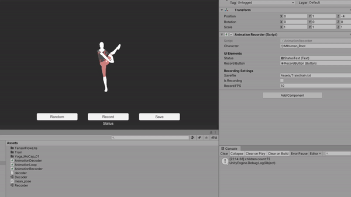

# Animation Autoencoder
Procedurally generate or interpolate between animations for a bipedal humanoid using a multi-pose autoencoder. TFlite is used within Unity to create animations in real time. The autoencoder is trained on animations from 3D content sites (e.g. https://www.mixamo.com/) and motion capture data from the mobile app: [Ditto](). Future encoders will be trained on data recorded from a curated list of videos. 

## Dependencies
- Python 3+
- Unity 3D

## Generate training data

### Record data with Mixamo
- download a few animations from https://www.mixamo.com/ 
- open Unity to the scene "Recorder"
- place animations in the folder `Animations/`
- Play the scene

### Create animations with a mobile device

Record an animation with our mobile app: [Ditto]()

## Procedural Animations
Joint rotations are recorded from a rigged character. The rotations are encoded using a fully connected neural network into a latent space of N dimensions. The latent space can be randomly sampled to create new poses. Sequences of poses can be constructed with bezier curves through the latent space

